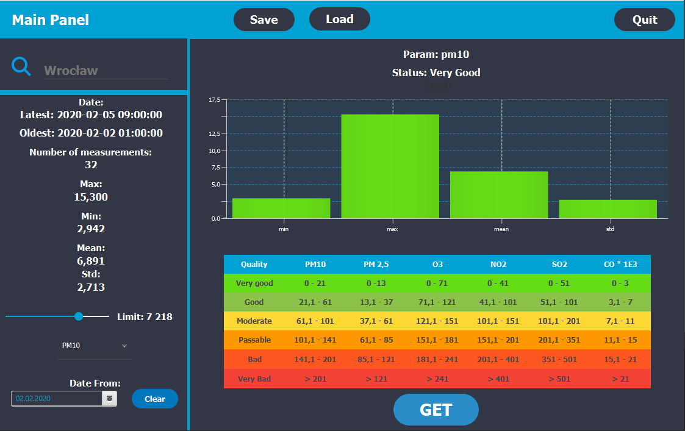
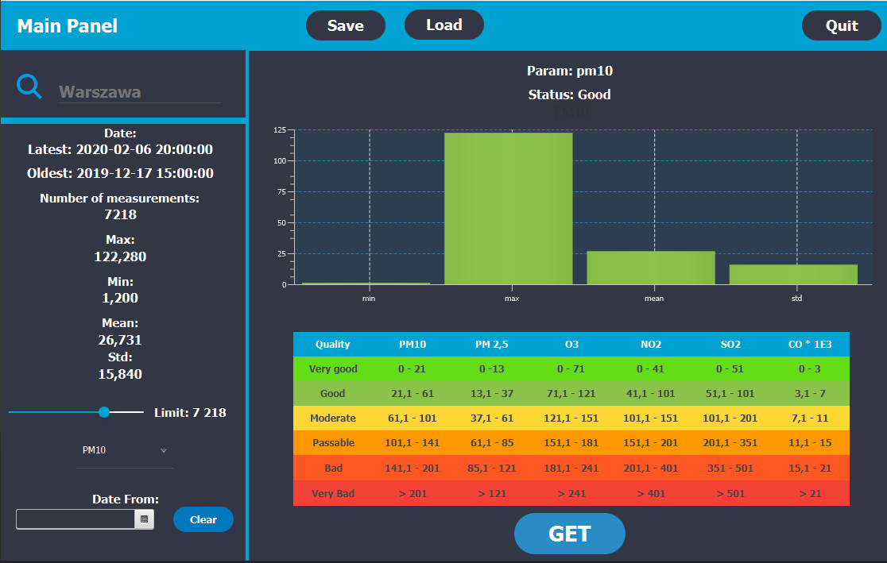

# WeatherStation
Desktop application made for object oriented programming course. It communicates with OPEN AQ API in order to get weather data.
It provides tool to monitore air status for a given city.
>
User can choose which city and air parameter to monitore. After application get data from api it is presented by a bar chart. Bar color is associated with quality status for a given parameter based on a:
[PARAMETERS TABLE](https://powietrze.gios.gov.pl/pjp/content/show/1001197)
>
User can also save current session data is json format. It is also possible to use saved data to analyze past measurements again.
>
Documentation: [JavaDoc](https://mmarciniak103.github.io/WeatherStation/)
>
## Technologies 
Project is created with:
* Java FX version 13
* Gson version 2.8.6
* JFoenix version 9.0.9
>

>

